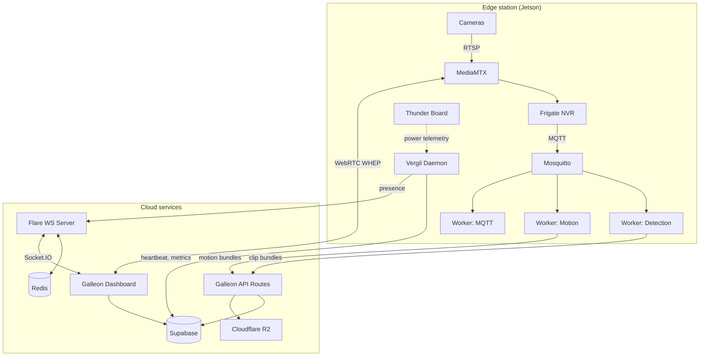

# Architecture overview

Argus follows an edge-cloud architecture where processing-intensive tasks (video recording, AI detection) happen on-site at each station, while the dashboard, storage, and user management live in the cloud. This design minimizes bandwidth usage and keeps the system responsive even with unreliable internet connections.

## System layers

### Edge layer

Each station is a Jetson device running four main components:

- **MediaMTX** receives RTSP feeds from cameras and re-publishes them as WebRTC (for live viewing) and RTSP (for Frigate recording).
- **Frigate NVR** records continuously, runs object detection (person, car, animal), and emits events over MQTT.
- **Mosquitto** is the local MQTT broker that routes Frigate events to the appropriate workers.
- **Vergil daemon** runs as a systemd service handling heartbeats, hardware metrics, VOD upload, and presence.

The **Thunder Board** (custom PCB) sits underneath, managing power distribution across channels and reporting telemetry (current, voltage, temperature) to the MCU.

### Cloud layer

- **Galleon** is the Next.js dashboard that users interact with. It talks to Supabase for data, MediaMTX for live streams, and Flare for real-time updates.
- **Supabase** provides PostgreSQL (with RLS for multi-tenancy), authentication (Google OAuth + email), file storage, and Realtime subscriptions.
- **Cloudflare R2** (S3-compatible) stores media files: VOD segments, detection clips, and motion thumbnails.
- **Flare** is a Socket.IO server backed by Redis that handles real-time presence (station online/offline) and viewer counts.

## Communication patterns

| From | To | Protocol | Purpose |
|---|---|---|---|
| Cameras | MediaMTX | RTSP | Video feed ingestion |
| MediaMTX | Galleon | WebRTC (WHEP) | Live stream viewing |
| MediaMTX | Frigate | RTSP | Recording and detection |
| Frigate | Mosquitto | MQTT | Detection/motion events |
| Workers | Galleon API | HTTPS | Upload clips, motions, VOD |
| Vergil daemon | Supabase | HTTPS | Heartbeat, metrics, auth |
| Vergil daemon | Flare | Socket.IO | Station presence |
| Flare | Galleon | Socket.IO | Real-time UI updates |
| Flare | Redis | Redis protocol | Session state, pub/sub |

## Data flow: from camera to dashboard

1. A camera pushes its RTSP stream to MediaMTX on the station.
2. MediaMTX makes the stream available as WebRTC for live viewing and forwards it to Frigate for recording.
3. Frigate detects an object (e.g., a person) and publishes an MQTT event with metadata (label, confidence, zone, timestamp).
4. The detection worker picks up the event, queries Frigate's database for the associated clip, packages a bundle (thumbnail + video + JSON metadata), and POSTs it to `POST /api/clip` on Galleon.
5. Galleon's API route validates the bundle, stores the media in Cloudflare R2, and inserts the event record into Supabase.
6. Supabase Realtime notifies any dashboard clients subscribed to that station's events.
7. The user sees the new event appear in the dashboard without refreshing.

## Authentication model

Argus uses two types of Supabase users:

- **Human users** authenticate via Google OAuth or email/password through Galleon's auth pages. They belong to organizations with role-based access (owner, admin, member).
- **Station users** are machine accounts created during station initialization. Each station gets an email derived from its `machine-id` (e.g., `abc123@station.covenant.space`) and authenticates to upload data and report metrics.

## Multi-tenancy

Organizations own stations and their associated data. Supabase Row-Level Security (RLS) policies enforce isolation -- users only see data belonging to their organization. The invitation system allows organization owners to add new members with specific roles.
