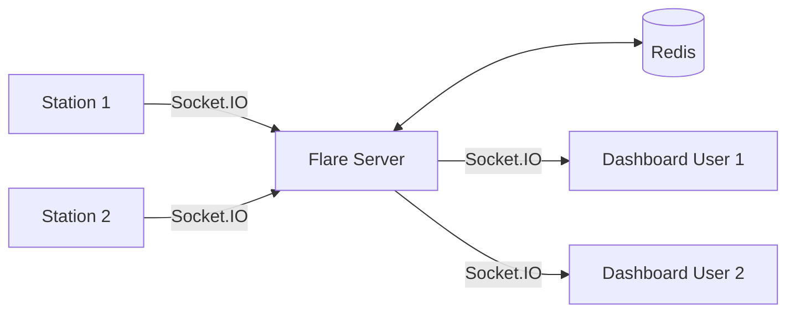

# Flare overview

Flare is the real-time communication layer of Argus. It runs a Socket.IO server backed by Redis that handles station presence (online/offline) and viewer count tracking. When a station comes online or a user opens a live stream, Flare broadcasts the update to all interested clients in real time.

## Architecture

Flare sits between edge stations and dashboard clients. Stations connect to announce their presence. Dashboard clients connect to receive live status updates. Redis serves as the pub/sub backbone and session store, enabling multiple Flare instances to share state.

## How it works

### Station connects
1. A Vergil daemon on a station opens a Socket.IO connection to Flare.
2. Flare validates the connection using the station's Supabase JWT token.
3. The station joins a channel named after its `HW_CODE`.
4. Flare broadcasts a `station_status: online` event to all clients watching that channel.

### Dashboard client connects
1. A user opens a device page in Galleon.
2. Galleon opens a Socket.IO connection to Flare and joins the station's channel.
3. Flare sends the current station status (online/offline) and viewer count.
4. As other users join or leave, Flare broadcasts updated `presence_update` events.

### Station disconnects
1. The Socket.IO connection drops (station shutdown, network loss).
2. Flare detects the disconnect and broadcasts `station_status: offline`.
3. The session is cleaned up in Redis.

## Source files

| File | Purpose |
|---|---|
| `main.py` | Creates ASGI app combining FastAPI and Socket.IO, runs uvicorn |
| `server.py` | Socket.IO event handlers: `connect`, `disconnect`, `join_channel`, `leave_channel`, `ping`. Authenticates via Supabase JWT. Manages Redis-backed pub/sub |
| `session.py` | `SessionManager` class: tracks connected clients in Redis hashes, maps sessions to users and channels, maintains per-channel member counts |

## Socket.IO events

| Event | Direction | Payload | Purpose |
|---|---|---|---|
| `connect` | Client to Flare | JWT token | Authenticate and establish session |
| `join_channel` | Client to Flare | `{ channel: HW_CODE }` | Subscribe to a station's updates |
| `leave_channel` | Client to Flare | `{ channel: HW_CODE }` | Unsubscribe from a station |
| `station_status` | Flare to clients | `{ status: "online" \| "offline" }` | Station connectivity change |
| `presence_update` | Flare to clients | `{ viewers: number }` | Viewer count change for a channel |
| `ping` | Client to Flare | -- | Keep-alive |

## Configuration

| Variable | Purpose |
|---|---|
| `REDIS_URL` | Redis connection string (session store + pub/sub) |
| `SUPABASE_URL` | Supabase URL for JWT validation |
| `SUPABASE_KEY` | Supabase anon key |
| `JWT_SECRET` | Secret for JWT token verification |
| `PORT` | Server port (default: 8000) |

## Tech stack

| Component | Technology |
|---|---|
| Web framework | FastAPI |
| WebSocket layer | python-socketio (Socket.IO protocol) |
| Session storage | Redis (hashes for sessions, pub/sub for cross-instance sync) |
| Auth validation | PyJWT + Supabase |
| ASGI server | uvicorn |
