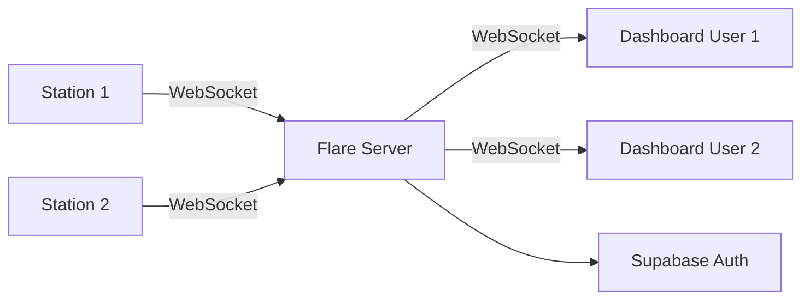

# Flare overview

Flare is the real-time communication layer of Argus. It runs a lightweight WebSocket server (~150 lines of code) that handles room-based presence tracking and state broadcasting. When a station comes online or a user opens a live stream, Flare broadcasts the update to all clients in the same room.

## Architecture



Flare sits between edge stations and dashboard clients. Stations connect to announce their presence. Dashboard clients connect to receive live status updates. All session state lives in memory -- Flare is a single-instance server with no external state store.

## How it works

### Authentication

Every WebSocket connection must include a Supabase JWT token, either as an `Authorization: Bearer <token>` header or as a `?token=<token>` query parameter. Flare validates the token by calling `supabase.auth.get_user(token)` and extracts the user ID for session tracking. Connections with invalid or missing tokens are rejected.

### Room-based pub/sub

Flare organizes connections into **rooms**. A room is a named group (typically a station's `HW_CODE`) that clients can join and leave. When a client sends a message to a room, all other clients in that room receive it.

1. Client connects and authenticates.
2. Client sends a `join` message with a room name.
3. Flare adds the client to the room and broadcasts a `join` event to existing members.
4. Flare sends the new client a `sync` message listing all current listeners.
5. When a client disconnects, Flare broadcasts `leave` to all rooms that client was in.

### Station presence flow

1. A Vergil daemon on a station opens a WebSocket connection to `ws://flare:8675`.
2. Flare validates the JWT and creates a session.
3. The daemon joins a room named after its `HW_CODE`.
4. Flare broadcasts the `join` event to any dashboard clients watching that room.
5. When the daemon disconnects (station shutdown, network loss), Flare broadcasts `leave`.

### Dashboard client flow

1. A user opens a device page in Galleon.
2. Galleon opens a WebSocket to Flare and joins the station's room.
3. Flare sends a `sync` with the current listener list (revealing if the station is online).
4. As other clients join or leave, Flare broadcasts updates in real time.

## Source files

| File | Purpose |
|---|---|
| `main.py` | Entry point: loads env vars, initializes `Server`, runs asyncio event loop |
| `server.py` | `Server` class: WebSocket handler, room management, authentication, message routing. Listens on `0.0.0.0:8675` |
| `session.py` | `Session` class: wraps a WebSocket connection with user ID, session ID, room subscriptions, and a thread-safe lock |

## Message protocol

All messages are JSON objects with a `type` field.

### Client to server

**Join a room:**
```json
{ "type": "join", "room": "station:abc123" }
```

**Broadcast state to room(s):**
```json
{ "type": "state", "payload": { "...": "..." }, "room": "station:abc123" }
```
If `room` is omitted, the state broadcasts to all rooms the client has joined.

**Leave a room:**
```json
{ "type": "leave", "room": "station:abc123", "close": false }
```
If `close` is `true`, the entire WebSocket connection closes.

**Keep-alive:**
```json
{ "type": "heartbeat" }
```

### Server to clients

**Join notification** (broadcast to room members when someone joins):
```json
{
  "id": "<session-uuid>",
  "type": "join",
  "room": "station:abc123",
  "user": { "id": "<supabase-user-id>" }
}
```

**Sync** (sent to the joining client with current room members):
```json
{
  "type": "sync",
  "room": "station:abc123",
  "listeners": ["<uuid1>", "<uuid2>"]
}
```

**State broadcast** (relayed to all room members except sender):
```json
{
  "id": "<session-uuid>",
  "type": "state",
  "payload": { "...": "..." },
  "room": "station:abc123",
  "user": { "id": "<supabase-user-id>" }
}
```

**Leave notification** (broadcast when a client leaves or disconnects):
```json
{
  "id": "<session-uuid>",
  "type": "leave",
  "room": "station:abc123",
  "user": { "id": "<supabase-user-id>" }
}
```

## Configuration

| Variable | Purpose |
|---|---|
| `SUPABASE_URL` | Supabase instance URL (for JWT validation) |
| `SUPABASE_API_KEY` | Supabase anon key |

The server listens on port `8675` by default.

## Tech stack

| Component | Technology |
|---|---|
| WebSocket server | `websockets` 15.0.1 (async) |
| Auth validation | Supabase Python SDK |
| Concurrency | asyncio event loop |
| Session state | In-memory (Python dicts + sets) |
| Thread safety | `threading.Lock` on rooms and sessions |

## Design considerations

Flare is intentionally minimal. It handles authentication and message routing without any business logic, persistence, or external state store.

> [!NOTE]
> All session state lives in memory. Flare runs as a single instance -- there is no cross-instance synchronization. For multi-instance deployments, a shared pub/sub backend (like Redis) would need to be added.
