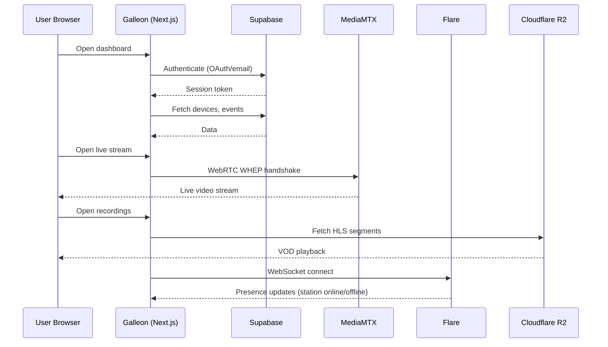

# Galleon overview

Galleon is the client-facing dashboard of the Argus platform. It gives users a single interface to watch live camera feeds, review recorded footage, manage detection events, and administer their organization and devices. Built with Next.js 16 and React 19, it connects to Supabase for data persistence and authentication, MediaMTX for live streaming, and Flare for real-time presence updates.

## Core capabilities

| Feature | Description |
|---|---|
| Live streaming | WebRTC-based live view powered by MediaMTX WHEP endpoint |
| VOD playback | HLS-based timeline player for recorded footage |
| Clip management | Review detection and motion clips with metadata overlays |
| Event tracking | Motion and object detection events from Frigate, filterable by type, date, and camera |
| Organization management | Multi-tenant support with owner/admin/member roles and email invitations |
| Device management | Monitor station health (CPU, GPU, RAM, storage, network), configure cameras |
| Billing | Stripe integration for subscriptions and one-time payments |
| Internationalization | i18next for multi-language support |

## Tech stack

| Layer | Technology |
|---|---|
| Framework | Next.js 16 (App Router) |
| UI | React 19, Tailwind CSS v4 |
| Language | TypeScript 5 |
| Database | PostgreSQL 15 via Supabase |
| Auth | Supabase Auth (Google OAuth, email/password) |
| Object storage | Supabase Storage + Cloudflare R2 |
| Live streaming | MediaMTX (WebRTC WHEP), HLS.js |
| Real-time | Flare (WebSocket) + Supabase Realtime |
| Forms | react-hook-form + zod validation |
| Payments | Stripe (webhooks at `/api/webhooks/stripe/`) |
| API docs | OpenAPI 3.0 (Swagger UI at `/api-docs`) |
| i18n | i18next |

## How Galleon connects to other services

## Sub-pages

- [[Galleon-App-Structure]] -- Route groups, layouts, and page organization
- [[Galleon-Streaming-and-Playback]] -- Live streaming (WebRTC) and VOD (HLS) architecture
- [[Galleon-Data-Layer]] -- Supabase integration, database helpers, and type system
- [[Galleon-API-Reference]] -- API routes that receive data from Vergil stations
