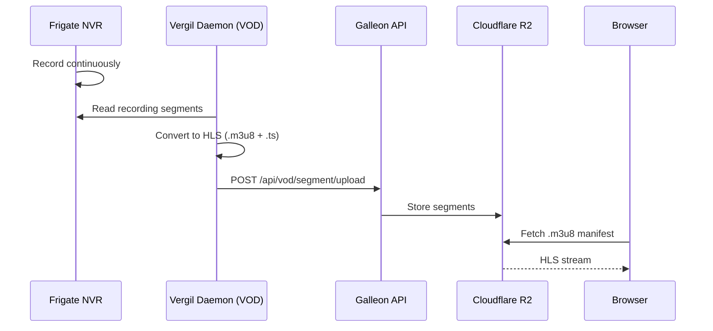

# Galleon streaming and playback

The dashboard supports two viewing modes: live streaming from cameras via WebRTC and recorded footage playback via HLS. Both rely on MediaMTX as the media gateway sitting on each station.

## Live streaming (WebRTC)

```mermaid
sequenceDiagram
    participant C as Camera
    participant M as MediaMTX
    participant B as Browser (Galleon)

    C->>M: RTSP feed
    B->>M: WHEP request (HTTP POST)
    M-->>B: SDP answer + ICE candidates
    B<-->M: WebRTC media stream (UDP)
```

Live video uses the **WHEP (WebRTC-HTTP Egress Protocol)**. When a user opens a live stream in Galleon, the `WebRTCPlayer` component initiates a WHEP handshake directly with the station's MediaMTX instance. The browser sends an HTTP POST with an SDP offer, receives an SDP answer, and establishes a peer-to-peer video stream.

This approach keeps live video latency under one second because the stream goes directly from MediaMTX to the browser -- Galleon's server is not in the video path.

### WebRTCPlayer component

The `WebRTCPlayer` component (`components/players/WebRTCPlayer/`) handles:
- WHEP negotiation with MediaMTX
- Connection state management (connecting, playing, error)
- Automatic reconnection on network interruptions
- Loading and error overlays

## Recorded footage (HLS)



Frigate records continuously to local storage. The Vergil daemon's VOD module picks up new recording segments, converts them to HLS format (`.m3u8` playlists + `.ts` segments), and uploads them to Galleon's API. The API stores them in Cloudflare R2 (S3-compatible object storage).

When a user opens recordings in the dashboard, the `HLSPlayer` component fetches the HLS manifest from R2 and plays back using `hls.js`.

### HLSPlayer component

The `HLSPlayer` component (`components/players/HLSPlayer/`) handles:
- HLS.js initialization and stream loading
- Quality level switching
- Buffering indicators
- Error recovery

### TimelinePlayer component

The `TimelinePlayer` component (`components/players/TimelinePlayer/`) adds a visual timeline scrubber on top of the HLS player, letting users navigate recordings by date and time with a visual indicator of available footage.

## Detection clips and motion events

Beyond continuous recordings, Galleon displays event-specific clips:

- **Detection clips** come from Frigate's object detection (person, car, animal). The detection worker packages a clip + thumbnail + metadata and uploads to `POST /api/clip`.
- **Motion events** come from Frigate's motion detection zones. The motion worker packages a thumbnail + metadata and uploads to `POST /api/motions`.

Both are stored in Cloudflare R2 and displayed in the device's clips/events tabs with filtering by event type, date range, and confidence level.
