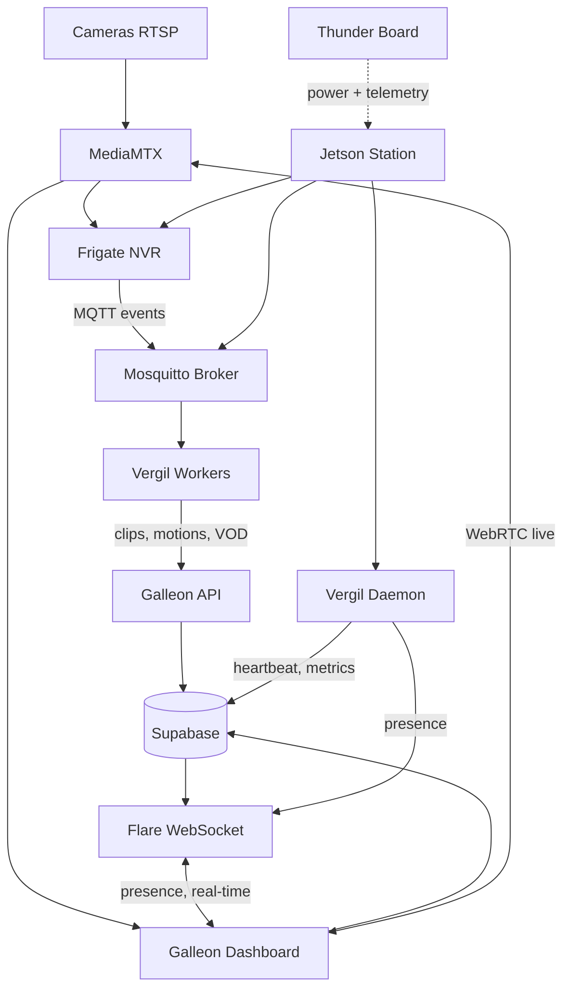

# Argus

Argus is an intelligent video surveillance platform built by Covenant. It combines edge computing on NVIDIA Jetson devices with a cloud-native dashboard to deliver real-time monitoring, AI-powered object detection, and complete recording management for physical security operations.

## How it works

Camera feeds enter each station via RTSP. MediaMTX re-publishes streams for both live viewing (WebRTC) and recording (Frigate NVR). Frigate runs AI-based object detection and publishes events over MQTT. Vergil workers pick up those events, package them as clips or motion bundles, and upload them to the Galleon API. The Vergil daemon monitors station health (CPU, GPU, RAM, temperature, network, storage) and reports to Supabase. Flare bridges real-time presence between stations and the dashboard via Socket.IO. The Thunder Board manages power distribution and telemetry for the physical hardware.

## Repositories

| Repository | Role | Tech stack |
|---|---|---|
| [[Galleon-Overview]] | Client dashboard | Next.js 16, React 19, TypeScript, Supabase |
| [[Vergil-Overview]] | Edge daemon and workers | Python, asyncio, MQTT, Docker |
| [[Flare-Overview]] | Real-time WebSocket server | Python, FastAPI, Socket.IO, Redis |
| [[Thunder-Board]] | Power distribution PCB | KiCad 9.0, ATmega328PB |

## Quick navigation

- **Understand the system** -- [[Architecture-Overview]]
- **Explore the dashboard** -- [[Galleon-Overview]] and its sub-pages
- **Understand edge stations** -- [[Vergil-Overview]] and [[Vergil-Daemon-Modules]]
- **Real-time layer** -- [[Flare-Overview]]
- **Hardware** -- [[Thunder-Board]]
- **Ideas for improvement** -- [[Ideas-and-Recommendations]]
