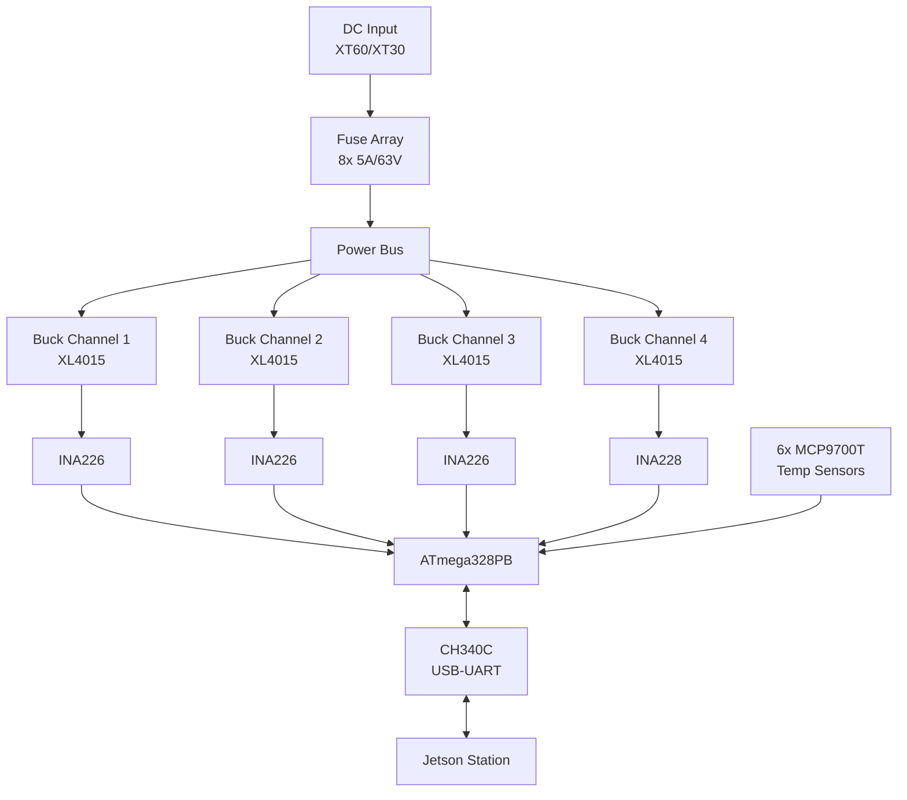

# Thunder Board

Thunder Board V1 is a custom 6-layer PCB designed by Covenant Hardware for managing power distribution and telemetry in multi-channel systems. In the Argus ecosystem, it sits underneath the Jetson station, providing regulated power to the compute module and cameras while monitoring electrical and thermal conditions.

## What it does

The board takes a high-voltage DC input (up to 63V) through XT60/XT30 connectors and distributes it across four independent buck converter channels, each with fuse protection and current/voltage monitoring. An onboard ATmega328PB microcontroller collects telemetry from the power monitors and temperature sensors and makes it available over USB-UART for the Jetson to read.

## Block diagram

The MCU reads current, voltage, and power from each channel via I2C (INA226/INA228 monitors) and temperature from six distributed analog sensors (MCP9700T). This data flows to the Jetson over USB-UART, where the Vergil daemon can include it in its telemetry reports.

## Key specifications

| Parameter | Value |
|---|---|
| PCB layers | 6 |
| Max operating voltage | 63V |
| Max fuse current | 5A per channel |
| Power channels | 4 (buck regulated) |
| Microcontroller | ATmega328PB @ 16 MHz |
| Communication | I2C (sensors), UART (USB), SPI (ISP programming) |
| Temperature range | -40 to +125 C (sensor range) |
| Design tool | KiCad 9.0 |

## Components

| Category | Key parts |
|---|---|
| Regulation | 4x XL4015 buck converters, 47uH inductors, SS54B Schottky diodes |
| Monitoring | 5x INA226 + 1x INA228 (current/voltage/power), 6x MCP9700T (temperature) |
| Protection | 8x 5A fuses, TVS diodes (P6KE15A) |
| MCU | ATmega328PB (TQFP32), 16 MHz crystal, CH340C USB-UART |
| Connectors | XT60 (2), XT30 (8), USB-C (3), WAGO terminals (4) |

## Schematic organization

The schematic spans seven hierarchical sheets in KiCad:

| Sheet | Content |
|---|---|
| Root | Top-level connections |
| 1 | Power input and main distribution |
| 2-5 | Individual power channels (regulation, filtering, monitoring) |
| 6 | MCU, USB-UART, communication |
| 7 | Temperature sensors and auxiliary circuits |

## Repository structure

The design files live in `Covenant_Hardware/Hardware_Design/`:

- `KiCad_Projects/Thunder_Board_KiCAD_V2/` -- Current KiCad 9.0 project (schematic + PCB + custom footprint library)
- `Thunder_Board_V1_docs/CAMOutputs/` -- Production-ready files (Gerber, drill, BOM, Pick & Place)
- `Placa de distribucion de potencia V2/Eagle Project/` -- Original Eagle CAD design (legacy reference)
- `Datasheet/` and component-specific directories -- Component datasheets

## Design evolution

| Revision | Description |
|---|---|
| REV001 | Initial design in Eagle CAD |
| REV002 | Migration to KiCad, electrical validation, BOM update |
| V2 (current) | PCB layout refinement in KiCad 9.0, updated net classes (1mm power traces, 0.2mm signal traces) |

> [!NOTE]
> Opening the project requires KiCad 9.0 or later. The custom footprint library (`Thunder_Board_V1.pretty/`) with 30+ footprints is included in the project directory.
