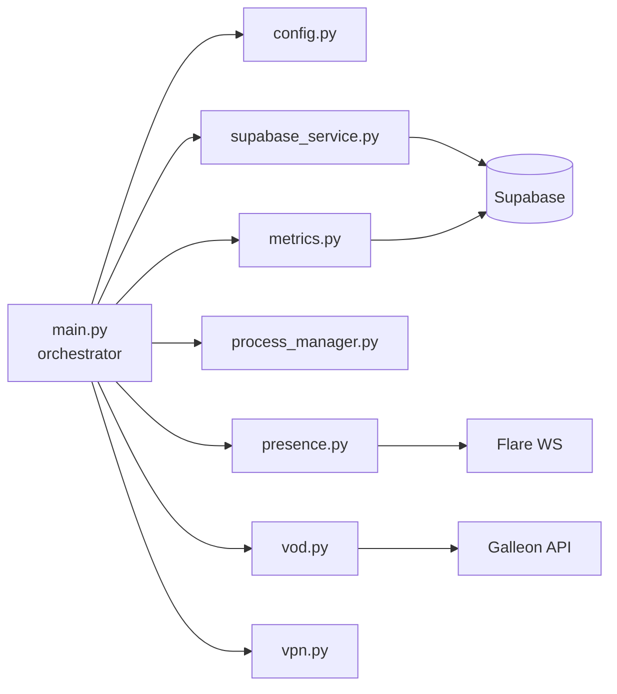

# Vergil daemon modules

The Vergil daemon is a Python service that runs as a systemd unit on each Jetson station. It coordinates heartbeats, hardware monitoring, VOD processing, and real-time presence. The daemon uses `asyncio` to run multiple concurrent loops.

## Module map

## `main.py` -- orchestrator

The entry point. Initializes all modules and runs them concurrently using `asyncio`:
- Heartbeat loop (periodic station status update)
- Metrics collection loop (every 60 seconds)
- Presence channel management
- VOD segment upload queue
- External process monitoring (MediaMTX, Frigate)

## `config.py` -- configuration

Loads configuration from two sources using StrictYAML:
- `/etc/vergil/variables.conf` (systemd service variables)
- `.env` file (Docker container variables)

Key configuration values:

| Variable | Purpose |
|---|---|
| `HW_CODE` | Station identifier (from `/etc/machine-id`) |
| `CHANNEL_NAME` | Presence channel name (same as `HW_CODE`) |
| `SUPABASE_URL` | Supabase project URL |
| `SUPABASE_API_KEY` | Supabase service key |
| `SUPABASE_EMAIL` | Station's machine account email |
| `SUPABASE_PASSWORD` | Station's machine account password |
| `VOD_UPLOAD_URL` | Galleon endpoint for VOD segments |
| `DEPLOY_ENV` | Environment: `local`, `stage`, or `prod` |

## `supabase_service.py` -- data access

Handles all communication with Supabase:
- **Authentication**: logs in as the station's machine user, manages JWT refresh
- **Heartbeat**: updates the `stations` table with timestamp, status, and VPN IP
- **Metrics insert**: writes computing records to `station_computing_record`

## `presence.py` -- real-time presence

Manages the station's presence on the Flare WebSocket server:
- Joins a channel named after the station's `HW_CODE`
- Tracks how many dashboard clients are watching the station
- Broadcasts online/offline status changes

This module is what makes the green/red "online" indicator work in the Galleon dashboard.

## `metrics.py` -- hardware monitoring

The `MetricsCollector` class gathers hardware telemetry every 60 seconds:

| Metric | Source | Notes |
|---|---|---|
| CPU usage (%) | `psutil.cpu_percent()` | Per-core average |
| GPU usage (%) | `jtop` (Jetson) or `psutil` fallback | Jetson-specific via `jetson-stats` |
| RAM usage (bytes) | `psutil.virtual_memory()` | Used and total |
| Temperature (C) | `jtop` thermal zones | CPU, GPU, board temps |
| Network I/O (bytes) | `psutil.net_io_counters()` | Cumulative since boot; Galleon calculates rates |
| Storage (bytes) | `shutil.disk_usage()` | Used and total for root partition |

> [!NOTE]
> Network counters reset to zero on reboot. The Galleon backend detects counter resets (current < previous) and handles them gracefully to avoid showing negative rates.

## `vod.py` -- VOD processing

Handles continuous recording upload:
1. Monitors Frigate's recording directory for new segments
2. Converts segments to HLS format (`.m3u8` playlists + `.ts` chunks)
3. Uploads to Galleon via `POST /api/vod/segment/upload`
4. Tracks upload progress to avoid re-uploading segments

## `process_manager.py` -- process lifecycle

Manages external processes that the daemon depends on:
- Starts and monitors MediaMTX and Frigate
- Health checks with automatic restart on failure
- Clean shutdown on daemon stop

## `vpn.py` -- VPN management

Retrieves the station's ZeroTier VPN IP address. This IP enables remote access to the station for maintenance and is reported in heartbeats so operators can SSH into stations from the dashboard.
