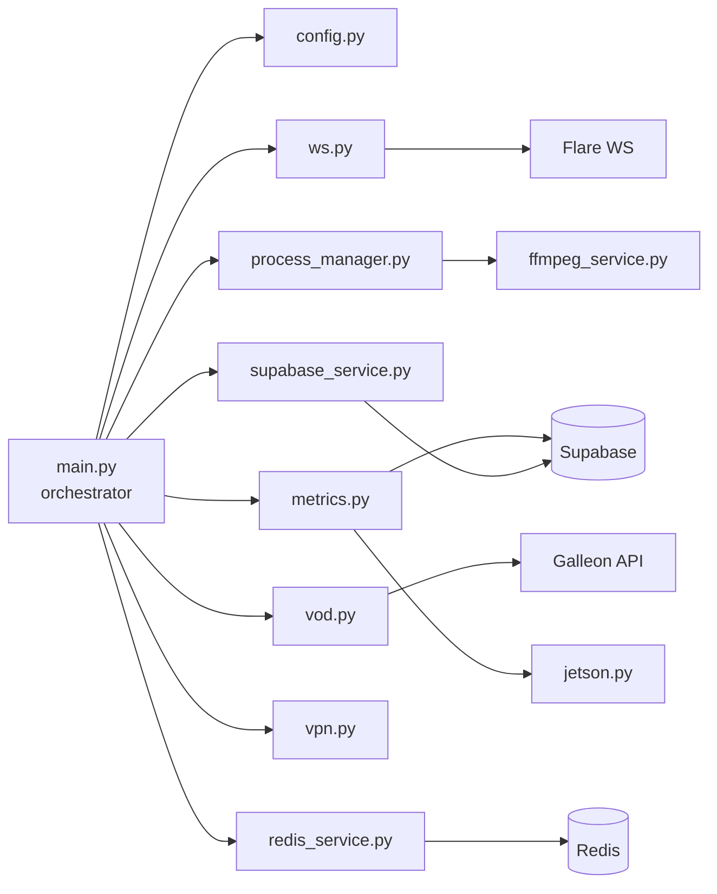

# Vergil daemon modules

The Vergil daemon is a Python service that runs as a systemd unit on each Jetson station. It coordinates heartbeats, hardware monitoring, VOD processing, and real-time presence. The daemon uses `asyncio` to run multiple concurrent loops.

## Module map

## `main.py` -- orchestrator

The entry point. Initializes all modules and runs six concurrent async loops:

- **Heartbeat loop** (every 10 seconds) -- updates station status in Supabase
- **Metrics loop** (every 20 seconds) -- collects and reports hardware telemetry
- **WebSocket loop** -- maintains presence connection to Flare
- **MQTT loop** -- listens for power/battery metrics from ESP32 hardware
- **Process monitor loop** -- watches ffmpeg restream processes
- **VOD request loop** -- processes video segment upload requests from Redis

The daemon implements a 7-phase graceful shutdown: cancel tasks, stop subprocesses, close WebSocket, cleanup VOD queues, close Redis, close Supabase, kill orphaned processes. Each phase has a 5-second timeout with a 15-second absolute maximum before forced exit.

## `config.py` -- configuration

Loads configuration from two sources using StrictYAML:
- `/etc/vergil/variables.conf` (systemd service variables)
- `.env` file (Docker container variables)

Key configuration values:

| Variable | Default | Purpose |
|---|---|---|
| `HW_CODE` | `"test"` | Station identifier (from `/etc/machine-id`) |
| `SUPABASE_URL` | `localhost:54321` | Supabase project URL |
| `SUPABASE_EMAIL` | -- | Station's machine account email |
| `SUPABASE_PASSWORD` | -- | Station's machine account password |
| `HEARTBEAT_INTERVAL` | `10` | Heartbeat frequency (seconds) |
| `METRICS_INTERVAL` | `20` | Metrics collection frequency (seconds) |
| `VIDEO_SERVER_URL` | `127.0.0.1:8554` | RTSP output destination |
| `WS_URL` | `ws://localhost:8675` | Flare WebSocket server |
| `MQTT_HOST` / `MQTT_PORT` | `localhost:1883` | Mosquitto broker |
| `REDIS_HOST` / `REDIS_PORT` | `localhost:6379` | Redis for VOD queue |
| `ZT_NETWORK_ID` | -- | ZeroTier VPN network ID |
| `VOD_UPLOAD_URL` | -- | Galleon VOD segment endpoint |
| `VOD_WORKERS` | `2` | Parallel VOD upload threads |
| `FORCE_SOFTWARE_DECODER` | `false` | Force CPU-based video decoding |

## `supabase_service.py` -- data access

Handles all communication with Supabase:
- **Authentication**: logs in as the station's machine user, auto-refreshes JWT tokens
- **Station metadata**: loads stream keys and camera list on startup
- **Heartbeat**: updates the `stations` table with timestamp, status, and VPN IP
- **Metrics insert**: writes computing records to `station_computing_record`
- **Session cleanup**: properly closes PostgREST HTTP sessions on shutdown

## `ws.py` -- WebSocket presence

Manages the station's connection to the Flare WebSocket server:
- Connects to `WS_URL` with a Bearer token for authentication
- Tracks listeners per room (room = station ID)
- Handles events: `join` (client connected), `leave` (client disconnected), `sync` (full listener list)
- **Triggers process start/stop**: when the first dashboard client joins, it starts the ffmpeg restream; when the last client leaves, it stops the restream
- Sends state updates and periodic heartbeats to keep the connection alive

This is what makes the green/red "online" indicator work in the Galleon dashboard and controls whether the station actively restreams video.

## `metrics.py` -- hardware monitoring

The `MetricsCollector` class gathers hardware telemetry every 20 seconds and inserts it into the `station_computing_record` table:

| Metric | Source | Notes |
|---|---|---|
| CPU usage (%) | `psutil.cpu_percent()` | Per-core average |
| GPU usage (%) | `jtop` (Jetson) or `psutil` fallback | Jetson-specific via `jetson-stats` |
| RAM usage (bytes) | `psutil.virtual_memory()` | Used and total |
| Temperature (C) | `jtop` thermal zones | CPU, GPU, board temps |
| Network I/O (bytes) | `psutil.net_io_counters()` | Cumulative since boot; Galleon calculates rates |
| Storage (bytes) | `shutil.disk_usage()` | Used and total for root partition |
| Power (W) | MQTT from ESP32 | Current, voltage, wattage per channel |
| Battery (%) | MQTT from ESP32 | State of charge, energy in/out |

> [!NOTE]
> Network counters reset to zero on reboot. The Galleon backend detects counter resets (current < previous) and handles them gracefully to avoid showing negative rates.

Power and battery metrics arrive via MQTT from an ESP32 device (connected to the Thunder Board) and are merged into the same telemetry report.

## `vod.py` -- VOD processing

Handles on-demand recording retrieval and upload:
1. Receives VOD requests from Redis (via `redis_service.py`)
2. Queries Frigate's SQLite database (`frigate.db`) to find recording segments by camera and time range
3. Converts segments to MPEG-TS format via ffmpeg
4. Pre-registers segments in Supabase before upload
5. Uploads to Galleon via `POST /api/vod/segment/upload` (multipart form with video, camera ID, timestamps)
6. Tracks cancelled requests and cleans up stale "processing" status
7. Notifies dashboard clients via WebSocket when segments are ready

## `process_manager.py` -- ffmpeg restream control

Manages ffmpeg restream processes that republish camera feeds to the RTSP server:
- **Probe phase**: detects available hardware decoders on startup (h264_nvmpi for Jetson, h264_cuvid for CUDA, software fallback)
- **Start**: spawns ffmpeg with input from camera's local RTSP URL, output to the MediaMTX RTSP server
- **Stop**: graceful termination (5-second timeout) then force kill
- **Monitor**: watches process health, logs unexpected exits
- Only runs when dashboard clients are connected (controlled by `ws.py` presence callbacks)

## `ffmpeg_service.py` -- codec utilities

Low-level ffmpeg/ffprobe utilities used by the process manager and VOD module:
- `get_available_decoders()` -- queries ffmpeg for installed hardware decoders
- `probe_stream_codec()` -- detects stream codec (H.264, HEVC) via ffprobe
- `select_decoder_for_codec()` -- picks the best decoder from a priority list (hardware first, software fallback)
- `restream()` -- spawns ffmpeg transcoding pipeline
- `convert_to_ts()` -- converts MP4 to MPEG-TS for VOD upload

## `jetson.py` -- metrics provider

Abstraction layer for hardware metrics that adapts to the runtime environment:
- Tries to import `jtop` (Jetson-specific library) for GPU, temperature, fan, and power metrics
- Falls back to a `PsutilMetricsProvider` on non-Jetson systems
- Ensures a consistent schema regardless of platform (Jetson-specific fields default to 0)

## `redis_service.py` -- VOD request queue

Connects to Redis to receive VOD playback requests from the dashboard:
- Subscribes to a Redis channel keyed by station ID
- Fetches any pending requests on startup
- Routes `new` messages to `vod.handle_record()` and `del` messages to `vod.cancel_record()`
- Runs a listener thread that bridges Redis pub/sub into the asyncio event loop

## `vpn.py` -- VPN management

Retrieves the station's ZeroTier VPN IP address by calling `zerotier-cli -j listnetworks` and filtering by network ID. The IP enables remote access for maintenance and is included in every heartbeat update so operators can SSH into stations from the dashboard.
