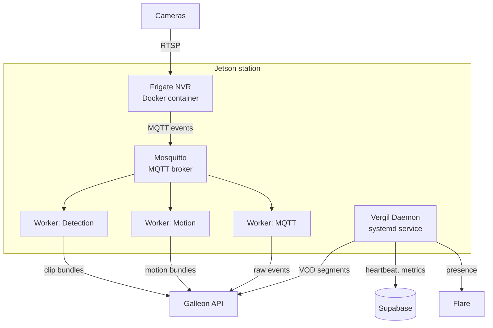

# Vergil overview

Vergil is the software stack that runs on each Argus edge station -- an NVIDIA Jetson device with connected cameras. It handles video recording, AI-based object detection, event processing, hardware monitoring, and data upload to the cloud. Vergil turns a Jetson into a self-contained surveillance node that operates autonomously and syncs with the Galleon dashboard.

## Components

| Component | Runs as | Role |
|---|---|---|
| **Vergil daemon** | systemd service | Heartbeat, metrics, VOD processing, presence, process management |
| **Frigate NVR** | Docker container | Continuous recording, object detection, motion detection |
| **Mosquitto** | Docker container | Local MQTT broker routing Frigate events to workers |
| **Detection worker** | Docker container | Packages and uploads object detection clips |
| **Motion worker** | Docker container | Packages and uploads motion event data |
| **MQTT worker** | Docker container | Forwards raw MQTT events to Galleon |

## How stations identify themselves

Each station has a unique `HW_CODE` derived from the Jetson's `/etc/machine-id`. This code:
- Identifies the station across all Argus services
- Forms the station's Supabase email (`{HW_CODE}@station.covenant.space`)
- Names the station's presence channel in Flare
- Tags all uploaded data (clips, motions, VOD segments, metrics)

## Sub-pages

- [[Vergil-Daemon-Modules]] -- Detailed breakdown of the daemon's Python modules
- [[Vergil-Workers]] -- How Frigate-to-Galleon workers process and upload events
- [[Vergil-Station-Setup]] -- Station initialization and deployment
