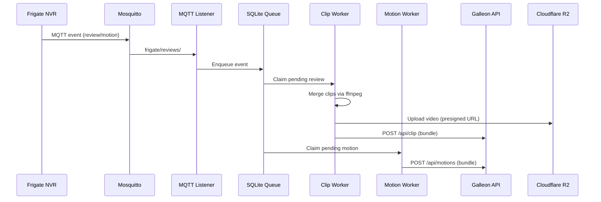

# Vergil workers

The Frigate-to-Galleon workers are Docker containers that capture Frigate NVR events via MQTT, queue them locally, and upload processed bundles to the Galleon API. The pipeline uses a two-stage design: an MQTT listener captures events into a local SQLite queue, and specialized workers process the queue at their own pace.

## Event flow



## Two-stage pipeline

### Stage 1: Event capture (`mqtt_to_queue.py`)

The MQTT listener subscribes to two Frigate topic patterns:
- `frigate/reviews/#` -- clip review events (object detection)
- `frigate/+/motion` -- motion detection events

When a clip review ends, the listener extracts the review ID and enqueues it into the `review_queue` table in a local SQLite database. For motion events, it tracks start/end timestamps and inserts completed motion ranges into the `motion_events` table.

> [!TIP]
> The listener can also be invoked via CLI (`mqtt_to_queue.py <review_id>`) to manually reprocess a specific review.

### Stage 2: Processing workers

#### Clip worker (`queue_worker.py`)

Processes the `review_queue` for detection clips:

1. Claims a pending review (status: `pending` -> `processing`).
2. Loads the review snapshot from Frigate's database via `db_access.py`.
3. Merges multiple recording segments into a single MP4 using ffmpeg (concat demuxer + H.264 re-encode via `media_tools.py`).
4. Uploads the merged video to Cloudflare R2 using a presigned URL.
5. POSTs the complete bundle to `POST /api/clip` on Galleon with metadata (camera, timestamps, detection labels).
6. Marks the review as `done`, `duplicate`, or `error`.

#### Motion worker (`motion_worker.py`)

Processes the `motion_events` table:

1. Polls for processable motion rows.
2. Builds a motion bundle with metadata and timestamps.
3. POSTs the bundle to `POST /api/motions` on Galleon.
4. Handles 401 errors with automatic token refresh.
5. Marks the event as `done` or `error`.

## Shared modules

| Module | Purpose |
|---|---|
| `covenant_client.py` | Supabase auth client with token caching, auto-refresh on expiry, and fallback to password login |
| `app_config.py` | Environment variable management with defaults for API URLs, MQTT settings, and HTTP timeouts |
| `db_access.py` | SQLite queue operations: `review_queue`, `snapshot_rows`, and `motion_events` tables with claim/status/list functions |
| `media_tools.py` | FFmpeg utilities: `merge_clips_to_h264_mp4()` (concat demuxer, yuv420p, faststart) and `get_video_duration()` |

## Queue states

Reviews and motions flow through these states:

```
pending -> processing -> done
                     -> duplicate  (event already exists in Galleon)
                     -> error      (upload failed after retries)
```

## Docker composition

```yaml
services:
  frigate:          # NVR with TensorRT detection (Jetson-optimized image)
  mosquitto:        # Eclipse Mosquitto 2.0 MQTT broker
  worker-mqtt:      # mqtt_to_queue.py (event capture)
  worker-detection: # queue_worker.py (clip processing)
  worker-motion:    # motion_worker.py (motion processing)
```

Exposed ports:
- Frigate: `8971` (dashboard), `5000` (API), `8554` (RTSP), `8555` (WebRTC)
- Mosquitto: `1883` (MQTT)
- Workers: no exposed ports (internal communication only)

Every container mounts `/etc/machine-id` to access the station's `HW_CODE` and reads environment variables from the shared `.env` file.

> [!IMPORTANT]
> Workers authenticate as the station's machine user in Supabase. The station must be registered (via `init_station.sh`) before workers can upload data.
