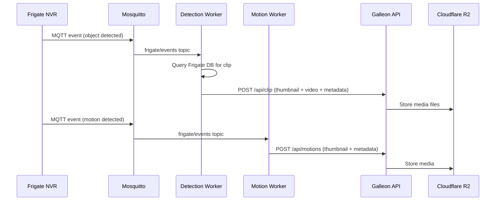

# Vergil workers

The Frigate-to-Galleon workers are Docker containers that listen for MQTT events from Frigate NVR and package them into bundles for upload to the Galleon API. Each worker specializes in a specific event type.

## Event flow



## Worker types

### Detection worker (`worker_detection.py`)

Processes object detection events. When Frigate detects a person, car, animal, or other configured object:

1. Receives the MQTT event with detection metadata (label, confidence, bounding box, zone, camera).
2. Queries Frigate's SQLite database to retrieve the associated video clip.
3. Extracts a thumbnail frame from the clip.
4. Packages a bundle: thumbnail (JPEG) + clip (MP4) + metadata (JSON).
5. POSTs the bundle to `POST /api/clip` on Galleon.

### Motion worker (`worker_motion.py`)

Processes motion detection events. When Frigate detects motion in a configured zone:

1. Receives the MQTT event with motion metadata (zone, timestamp, camera).
2. Extracts a thumbnail from the motion snapshot.
3. Packages a bundle: thumbnail (JPEG) + metadata (JSON).
4. POSTs the bundle to `POST /api/motions` on Galleon.

### MQTT worker (`worker_mqtt.py`)

A generic event forwarder that relays raw Frigate MQTT messages to Galleon for logging and real-time dashboard updates.

## Shared modules

| Module | Purpose |
|---|---|
| `queue_worker.py` | Base class for MQTT workers -- handles connection, subscription, and message routing |
| `supabase_client.py` | Station authentication with Supabase (shared JWT management) |
| `frigate_db.py` | Queries Frigate's SQLite database for clips and recordings metadata |

## Docker composition

All workers run as Docker containers defined in `docker-compose.yml`:

```yaml
services:
  frigate:        # Frigate NVR with object detection
  mosquitto:      # MQTT broker
  worker-mqtt:    # Raw event forwarder
  worker-detection: # Detection clip bundler
  worker-motion:  # Motion event bundler
```

Every container mounts `/etc/machine-id` to access the station's `HW_CODE` and reads environment variables from the shared `.env` file.

> [!IMPORTANT]
> Workers authenticate as the station's machine user in Supabase. The station must be registered (via `init_station.sh`) before workers can upload data.
